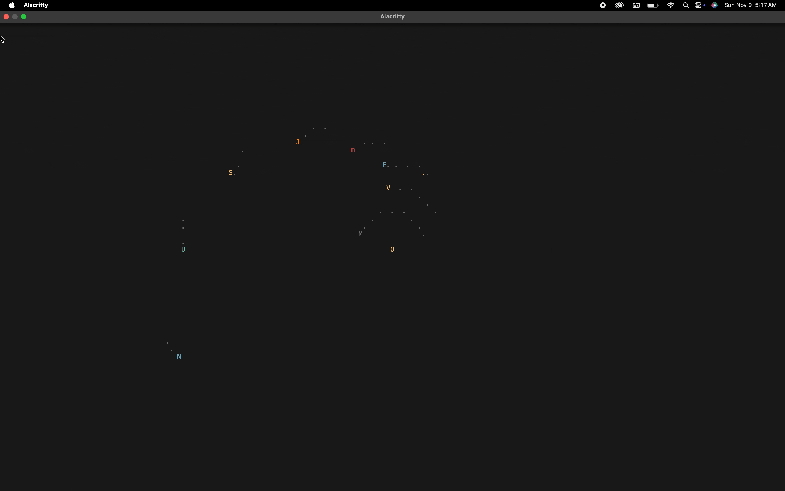
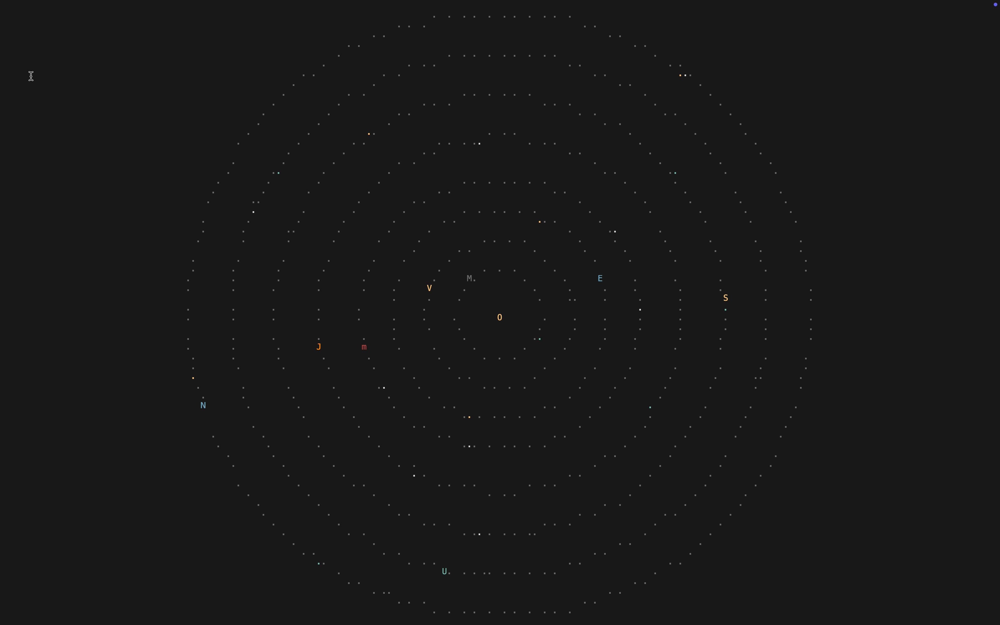

<h1 align="center">༄˖°.🪐.ೃ࿔*:･ ASCII Orbit ･:*࿔ೃ.🪐.°˖༄</h1>
⠀⠀⠀⠀⠀⠀⠀⠀⠀⠀⠀⠀⠀⠀⠀⠀⠀⠀⠀⠀

                   :
                   :
                   :
                   :
    .              :
     '.            :           .'
       '.          :         .'
         '.   .-""""""-.   .'                                   .'':
           '."          ".'                               .-""""-.'         .---.          .----.        .-"""-.
            :            :                _    _        ."     .' ".    ..."     "...    ."      ".    ."       ".
    .........            .........    o  (_)  (_)  ()   :    .'    :   '..:.......:..'   :        :    :         :   o
            :            :                              :  .'      :       '.....'       '.      .'    '.       .'
             :          :                             .'.'.      .'                        `''''`        `'''''`
              '........'                              ''   ``````
             .'    :   '.
           .'      :     '.
         .'        :       '.
       .'          :         '.
                   :
                   :
                   :
                   :
#### A ASCII art solar system built directly into your terminal.


## Usage
### Starting Animation for the program


### Fully drawn System



### MacOS / Linux
Run the command below in your terminal and it will download.\
curl -sSL https://raw.githubusercontent.com/Lokonco/ASCIIOrbit/main/install.sh | bash\
I am working on getting a brew tap going

### Windows
If you coding in c++ on windows then you should know how to run this.

## License

[WTFPL](https://www.wtfpl.net/)
